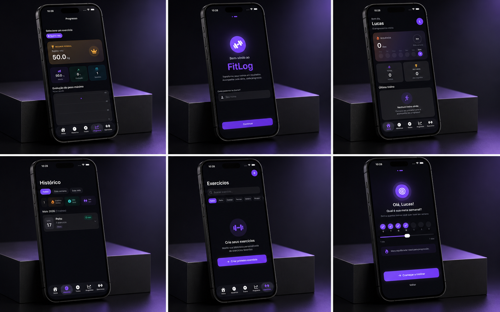

<div align="center">

# 💪 FitLog

### Transforme seus treinos em resultados.

**Acompanhe cada série, cada progresso — tudo em um app iOS nativo.**

[](https://swift.org)
[](https://developer.apple.com/xcode/swiftui/)
[](https://developer.apple.com/ios/)
[](https://developer.apple.com/xcode/)
[](LICENSE)

</div>

---

## 📱 Visão Geral

O **FitLog** é um aplicativo iOS de registro e acompanhamento de treinos desenvolvido nativamente com **SwiftUI**. Com uma interface moderna e dark, o app oferece uma experiência completa para quem busca evoluir nos treinos — do onboarding personalizado ao gráfico de recordes pessoais.

> *"O progresso é a vitória."*

---

## ✨ Funcionalidades

### 🏠 Dashboard (Início)
- Saudação personalizada com o nome do usuário
- Card de **sequência de treinos** com visualização semanal
- Estatísticas rápidas: total de treinos e recorde de dias seguidos
- Acesso ao último treino realizado

### 📅 Histórico
- Visualização de todos os treinos realizados, organizados por mês
- Filtros por **esta semana** e **este mês**
- Métricas consolidadas: total de treinos, tempo total e volume (toneladas)
- Cards expandíveis com detalhes de cada sessão

### 🏋️ Treino
- Criação e gerenciamento de fichas de treino
- Registro de séries, repetições e carga
- Temporizador de descanso integrado

### 📊 Progresso
- Acompanhamento de evolução por exercício
- **Recorde pessoal** destacado em destaque
- Gráfico de evolução do peso máximo por sessão
- Métricas: média de carga, percentual de evolução e total de sessões

### 🗂️ Exercícios
- Biblioteca de exercícios totalmente personalizável
- Filtro por grupo muscular (Peito, Costas, Pernas, Ombro, Bíceps, Tríceps, Abdômen, Glúteos)
- Suporte a equipamentos: Barra, Halter, Máquina, Cabo, Peso Corporal, Kettlebell
- Classificação por tipo: **Composto** ou **Isolado**
- Busca por nome em tempo real

### 🎯 Onboarding
- Fluxo de boas-vindas de 2 etapas
- Entrada de nome personalizado
- Definição de **meta semanal de treinos** (1 a 7 dias) com slider interativo
- Feedback motivacional dinâmico com base na meta escolhida

---

## 🛠️ Tecnologias

| Tecnologia | Uso |
|---|---|
| **Swift 5.9** | Linguagem principal |
| **SwiftUI** | Interface declarativa em todas as telas |
| **SwiftData** | Persistência de exercícios, treinos e séries |
| **Charts** | Gráficos de evolução de carga |
| **MVVM** | Arquitetura do projeto |

---

## 🏗️ Arquitetura

O projeto segue o padrão **MVVM (Model-View-ViewModel)**, garantindo separação de responsabilidades e testabilidade.

```
FitLog/
├── App/
│   └── FitLogApp.swift
├── Models/
│   ├── Workout.swift
│   ├── Exercise.swift
│   └── WorkoutSet.swift
├── ViewModels/
│   ├── HomeViewModel.swift
│   ├── ProgressViewModel.swift
│   └── ExerciseViewModel.swift
├── Views/
│   ├── Onboarding/
│   ├── Home/
│   ├── History/
│   ├── Workout/
│   ├── Progress/
│   └── Exercises/
├── Components/
│   └── (Componentes reutilizáveis)
└── Data/
    └── SwiftDataContainer.swift
```

---

## 🚀 Como Executar

### Pré-requisitos

- Xcode 15+
- iOS 17+ (simulador ou dispositivo físico)
- macOS Ventura ou superior

### Instalação

```bash
# Clone o repositório
git clone https://github.com/seu-usuario/fitlog.git

# Abra no Xcode
cd fitlog
open FitLog.xcodeproj
```

1. Selecione um simulador iPhone (recomendado: iPhone 15 Pro)
2. Pressione `Cmd + R` para compilar e executar

---

## 📸 Screenshots

<div align="center">

</div>

---

## 🎨 Design

- **Tema:** Dark exclusivo com identidade visual em roxo (`#8B5CF6`)
- **Tipografia:** SF Pro (fonte nativa iOS)
- **Componentes:** Cards com gradientes sutis, badges coloridos por grupo muscular
- **Acessibilidade:** Suporte a Dynamic Type e contraste elevado

---

## 📄 Licença

Este projeto está sob a licença MIT. Veja o arquivo [LICENSE](LICENSE) para mais detalhes.

---

<div align="center">

Desenvolvido com ❤️ e Swift

</div>
